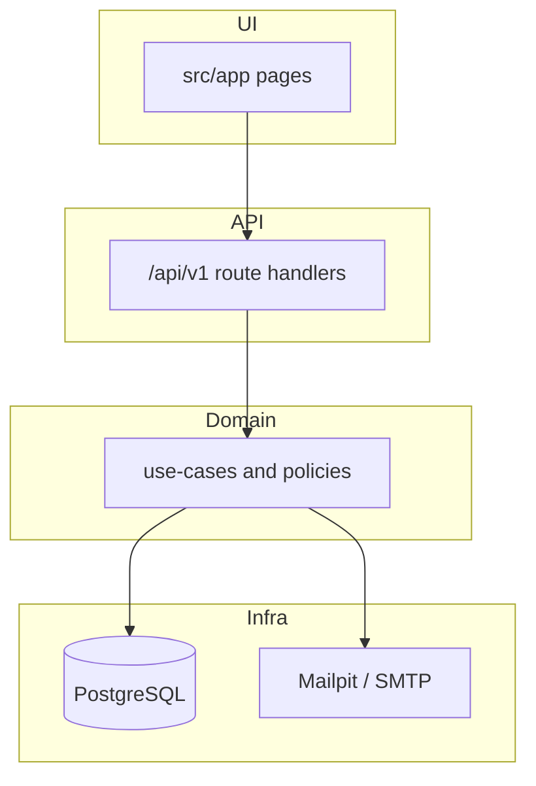

# kickoff-club

**kickoff-club helps local pickup groups schedule matches, collect RSVPs with waitlists, and give organizers timezone-aware tools without spreadsheets.**

## Why it exists

Pickup sports groups juggle chat threads, unclear headcounts, and last-minute dropouts. kickoff-club models the real domain: **groups** with organizer/player roles, **invites**, **matches** (one-off and recurring series), **RSVPs** with capacity and waitlist promotion, **notifications**, and **no-show** tracking. The codebase is a teaching-grade full stack app (SRS §9): strict layering, OpenSpec change control, Dockerized Postgres, and CI that runs unit, integration, and Playwright tests.

## Demo

### Docker Compose + seed

```bash
cp .env.example .env
docker compose up --build
# In another terminal once the app is healthy:
docker compose exec app pnpm db:seed
```

One-liner (migrations + seed without starting the long-running app):

```bash
docker compose up -d db mailpit && docker compose run --rm migrate && docker compose run --rm --no-deps app pnpm db:seed
```

### Demo sign-in

After seeding, open http://localhost:3000/login and use:

| Role | Email | Password |
|------|-------|----------|
| Organizer | `organizer@demo.kickoff.local` | `DemoKickoff12!` |
| Player | `player@demo.kickoff.local` | `DemoKickoff12!` |

Then visit `/app`, open the **Saturday Pickup (Demo)** group, and view the upcoming **Demo kickaround** match.

Mailpit (captured email): http://localhost:8025

## Stack (and why)

| Piece | Role |
|-------|------|
| **TypeScript** | End-to-end typing from Drizzle schema to UI |
| **Next.js 15 App Router** | UI in `src/app/`; **REST JSON at `/api/v1` via Route Handlers** so HTTP stays thin and domain logic stays in `src/modules/*/domain/` (no separate API process to deploy for this learning scope) |
| **PostgreSQL 16** | Relational source of truth for groups, matches, RSVPs, sessions |
| **Drizzle ORM** | Typed schema + forward-only SQL in `drizzle/` |
| **Docker Compose** | Postgres, Mailpit, migrate job, and app for one-command review |
| **Vitest** | Unit + HTTP integration tests against real Postgres |
| **Playwright** | Browser critical path in CI (`e2e/`) |
| **GitHub Actions** | `quality` job: lint → typecheck → migrate → seed ×2 → test → build → e2e → OpenSpec validate |
| **OpenSpec** (`@fission-ai/openspec`) | Proposal gate for non-trivial features (`openspec/`) |

Package manager: **pnpm** (lockfile committed).

## How to run

```bash
cp .env.example .env
docker compose up --build
```

Compose starts Postgres, runs **migrations** (`migrate` service), Mailpit, then the Next.js app on http://localhost:3000.

### Local app without Compose (Postgres still required)

```bash
docker compose up -d db mailpit
docker compose run --rm migrate
pnpm install
pnpm dev
pnpm db:seed   # optional demo data
```

### Database commands

```bash
pnpm db:migrate   # apply drizzle/ SQL
pnpm db:verify    # assert core tables exist
pnpm db:seed      # idempotent demo group, users, upcoming match
```

## Tests & CI

[](https://github.com/drkwv34/kickoff-club/actions/workflows/ci.yml)

```bash
pnpm lint
pnpm typecheck
pnpm db:migrate
pnpm test           # Vitest (needs Postgres)
pnpm build
pnpm test:e2e       # Playwright (see e2e/README.md)
```

Pull requests and `main` run the **`quality`** workflow in `.github/workflows/ci.yml`.

## Architecture sketch

```
┌─────────────────────────────────────────────────────────┐
│  UI — React / App Router (src/app/)                      │
└───────────────────────────┬─────────────────────────────┘
                            │ fetch / server components
┌───────────────────────────▼─────────────────────────────┐
│  API — Route handlers (src/app/api/v1/)                    │
└───────────────────────────┬─────────────────────────────┘
                            │ use-cases
┌───────────────────────────▼─────────────────────────────┐
│  Domain — src/modules/{auth,groups,matches,rsvps,...}/domain │
└───────────────────────────┬─────────────────────────────┘
                            │ ports
┌───────────────────────────▼─────────────────────────────┐
│  Infra — Drizzle repos, SMTP (src/lib/db, */infra/)        │
└─────────────────────────────────────────────────────────────┘
```



Deeper docs: [`docs/architecture/`](docs/architecture/) · OpenSpec: [`openspec/`](openspec/)

## Hard edges

- **Authz** — Group **organizer** vs **player** roles; demoting or removing the **last organizer** returns `409 LAST_ORGANIZER`. Match management checks membership + role in domain policies.
- **Waitlist races** — Cancelling a `going` RSVP promotes the earliest waitlisted row in the **same transaction** as the cancel, with `SELECT … FOR UPDATE` on the match so `going_count` cannot exceed capacity under concurrency. See [`docs/architecture/transactionality.md`](docs/architecture/transactionality.md).
- **Timezones** — Users register with an IANA timezone; groups have `home_timezone`; matches store `start_at`/`end_at` as UTC instants plus a display timezone. UI helpers format wall-clock times for viewers (see `src/modules/matches/domain/time-display.ts`).
- **Sessions & CSRF** — HttpOnly session cookie; mutating `/api/v1` routes require double-submit CSRF (`kickoff_csrf` cookie + `X-CSRF-Token`).

## Trade-offs / what I'd do differently

- **Monolith Next.js** — Route Handlers keep the repo small for a case study; at higher scale I'd split a dedicated API service and keep Next for UI only.
- **Postgres-only** — No read replicas or event bus; notifications use in-app rows and SMTP adapter with retries documented under `docs/architecture/external-integrations.md`.
- **Email** — Mailpit locally; production would need real SMTP secrets, bounce handling, and outbox hardening (schema supports notification flows; full deliverability ops are out of scope).
- **Seed** — Fixed demo IDs and emails for idempotency; a richer seed might add RSVPs and invite links, but that would duplicate Playwright coverage.

## Repository metadata

If GitHub **About** cannot be updated via API, use:

- **Description:** Pickup-sports match organizer: RSVPs, waitlists, timezone-aware schedules, and organizer tools for local groups.
- **Topics:** `typescript`, `nextjs`, `postgresql`, `docker`, `github-actions`, `playwright`, `fullstack`, `rbac`, `saas`

## License

MIT — see [LICENSE](LICENSE).
